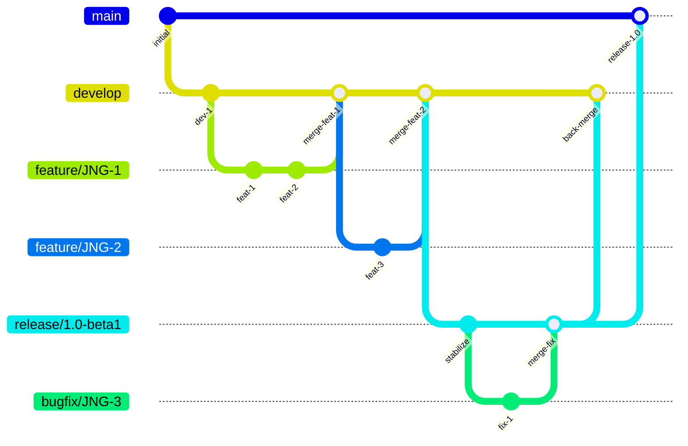
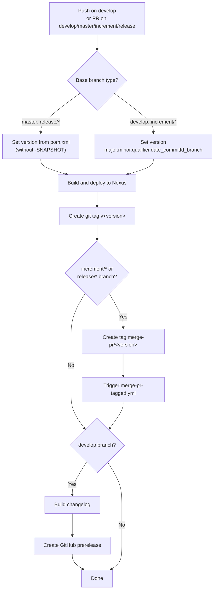
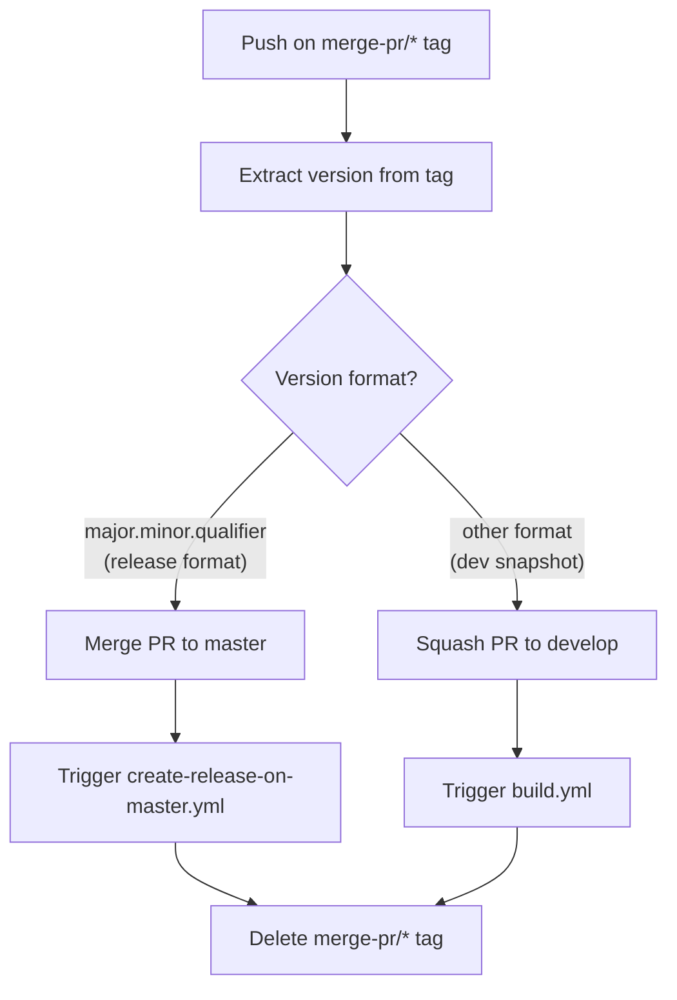
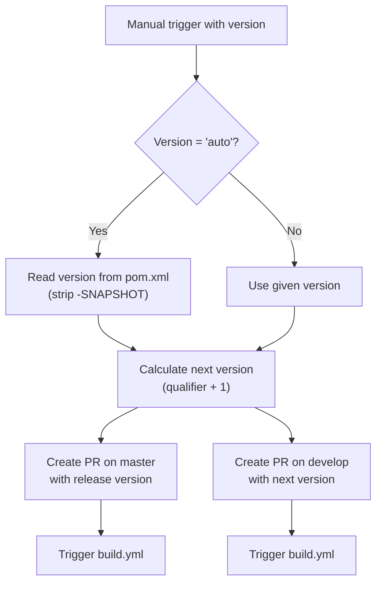
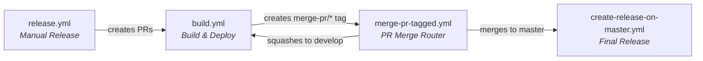

# Development Version and Branch Handling

This document describes the branching strategy, version numbering policy, and CI/CD workflow automation used across JUDO NG modules.

## Branching Strategy

The project follows a **GitFlow-based** branching model. Each branch type serves a specific purpose in the development and release lifecycle:

| Branch Pattern | Purpose | Based On |
|---------------|---------|----------|
| `develop` | Active development of the latest version | — |
| `feature/JNG-<number>_
` | New feature work | `develop` |
| `(release/)<version>` | Release stabilization and testing | `develop` |
| `bugfix/JNG-<number>_
` | Bug fixes during release testing | Release branch |
| `support/JNG-<number>_
` | Minor changes to a previous release | Release branch |
| `hotfix/JNG-<number>_
` | Urgent fixes for production | `master` |
| `master` | Latest released sources | Merged from release |

## Version Numbers

Versions follow **semantic versioning** with these rules:

| Event | Version Change | Example |
|-------|---------------|---------|
| Start a feature branch | No change | Inherits from `develop` |
| Start a release branch | Bump 2nd number on `develop` | `1.1.0-SNAPSHOT` → `1.2.0-SNAPSHOT` |
| Start a bugfix branch | No change | Inherits from release branch |
| Start a support branch | Bump 3rd number | `1.0.0` → `1.0.1` |
| Start a hotfix branch | Bump 4th number | `1.0.0` → `1.0.0.1` |

## GitHub Actions CI/CD Workflows

The project uses a chain of GitHub Actions workflows that trigger each other. Here is how they connect:

### build.yml — Main Build Pipeline

This is the primary workflow, triggered on pushes to `develop` or pull requests targeting `develop`, `master`, `increment/*`, or `release/*` branches.

### merge-pr-tagged.yml — PR Merge Automation

Triggered when a `merge-pr/*` tag is pushed. Routes the merge based on version format:

### create-release-on-master.yml — Release Finalization

Triggered on pushes to `master`. Creates a final GitHub release with a generated changelog.

### release.yml — Manual Release Trigger

Manually triggered with a version parameter (or `auto` to use the pom.xml version):

### Complete Workflow Chain

## Development Rules

> **Important:** There is no commit without a ticket number. Every pull request and commit must reference a JIRA ticket in the format `JNG-xxx`.

Issue tracking is managed through [JIRA](https://blackbelt.atlassian.net/jira/dashboards).
