# Contributing to JUDO

Thank you for your interest in contributing to JUDO! This guide covers everything you need to set up your development environment, understand the code structure, and submit changes.

## Development Environment Setup

### Required Software

| Tool | Version | Notes |
|------|---------|-------|
| Java JDK | 21 | Source and target level |
| Maven | 3.9.4+ | Or use `./mvnw` wrapper |
| Eclipse IDE | Latest | With plugins listed below |

> **Note:** For full requirements, see the parent project's [contributing guide](https://github.com/BlackBeltTechnology/judo-community/blob/develop/CONTRIBUTING.adoc).

### Eclipse Plugin Requirements

To work with the XText-based language project in Eclipse, install the following features:

- **m2e** — Maven integration for Eclipse
- **Modeling Tools** — EMF and related tooling
- **XText** — Language framework
- **Xtend** — Used for scoping, validation, and formatting implementations
- **MWE / MWE2** — Model workflow engine for code generation

### Eclipse Installation via P2

You can install the JSL plugin via the Eclipse P2 update site mechanism:

1. Go to **Help > Install New Software...**
2. Add the P2 site URL listed on the GitHub releases page (or point to an uncompressed ZIP folder)
3. The plugin includes the metamodel and the default JSL editor

## Code Structure

This project uses Maven with Tycho for Eclipse/OSGi module builds. Modules are grouped into several layers:

```mermaid
graph TD
    subgraph "Eclipse/Tycho Modules"
        feature["feature/ — Eclipse feature repository"]
        ide["ide/ — Eclipse IDE language support"]
        site["site/ — P2 update site"]
    end

    subgraph "Model Modules"
        model["model/ — XText grammar, scoping, validation"]
        model-test["model-test/ — Parser & language tests"]
    end

    subgraph "Generator Modules"
        gen-engine["generator-engine/ — Handlebars template engine"]
        gen-plugin["generator-maven-plugin/ — Maven plugin"]
        gen-plugin-test["generator-maven-plugin-test/ — Plugin tests"]
    end

    subgraph "OSGi Modules"
        osgi["osgi/ — OSGi bundle wrapper"]
        osgi-itest["osgi-itest/ — Karaf smoke tests"]
    end

    subgraph "LSP Modules"
        server-embedded["server-embedded/ — Standalone LSP fat JAR"]
        server-web["server-web/ — Web-based Monaco editor"]
    end

    model-test -.->|tests| model
    gen-engine --> model
    osgi --> model
    ide --> model
    server-embedded --> model
    server-web --> model
```



### Eclipse-Specific Modules

- **`feature/`** — Eclipse feature repository for installing JSL as an Eclipse feature
- **`ide/`** — Eclipse IDE support with sub-modules: `ide-common` (content assist), `ui` (editor plugin), `preview-plantuml` (PlantUML diagram preview), and `feature` (IDE feature packaging)
- **`site/`** — Eclipse P2 update site. Version-specific URLs are generated because Tycho requires versions in the URL. Use the following command to update category versions:

  ```bash
  ./mvnw clean install -P update-category-versions -f site/pom.xml
  ```

### Code Generation in Eclipse

To regenerate the XText language infrastructure (parser, serializer, EMF model classes) after grammar changes:

1. Run the predefined launcher: **`Generate JSL.launch`**
2. Alternatively, run as MWE2 Workflow: `hu.blackbelt.judo.meta.jsl.model project src/workflow/generateModel.mwe2`

### Testing the Language in Eclipse

Run the **`Launch JSL.launch`** launcher to start an Eclipse runtime with the JSL plugin installed.

> **Warning:** Make sure the Maven build or code generation steps have completed successfully before running the launcher.

## Troubleshooting

### Lombok Compatibility

Tycho does not support Lombok code generation directly (see [lombok#285](https://github.com/rzwitserloot/lombok/issues/285)). As a result, **no Lombok is used in Eclipse plugin modules**. All source code in these modules is either hand-written or generated by XText/MWE2.

## Version Policy

This project bridges two versioning worlds — Maven and Eclipse have different conventions:

| Convention | Format | Example |
|-----------|--------|---------|
| Maven snapshot | `<major>.<minor>.<patch>-SNAPSHOT` | `1.0.0-SNAPSHOT` |
| Eclipse qualifier | `<major>.<minor>.<patch>.qualifier` | `1.0.0.qualifier` |

The **Tycho Versions Plugin** synchronizes these during builds, replacing qualifiers and Maven versions with a consistent technical version number.

Version update commands:

```bash
# Set a new version across all modules
./mvnw versions:set -DnewVersion=<VERSION>
./mvnw tycho-versions:update-eclipse-metadata
```

## Submission Guidelines

### Submitting an Issue

Before submitting, search the [issue tracker](https://github.com/BlackBeltTechnology/judo-meta-jsl/issues) — your issue may already exist or have been resolved.

To help us reproduce and fix bugs quickly, please provide:

- Output of `java -version` and `mvn -version`
- Relevant `pom.xml` or `.flattened-pom.xml`
- A **minimal reproduction case** that demonstrates the failure

We will ask for a minimal reproduction to save maintainers' time and fix more bugs efficiently.

[File a new issue](https://github.com/BlackBeltTechnology/judo-meta-jsl/issues/new/choose)

### Submitting a Pull Request

This project follows [GitHub's standard forking model](https://guides.github.com/activities/forking/). Fork the project and submit pull requests from your fork.

## Commands

### Run Tests

```bash
./mvnw clean test
```

### Run Full Build

```bash
./mvnw clean install
```
