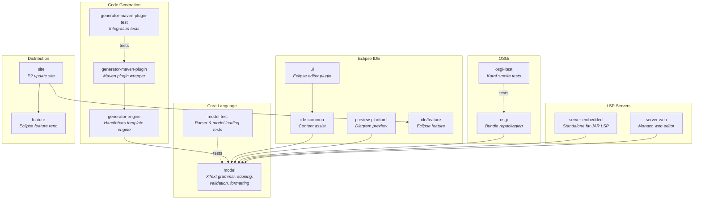
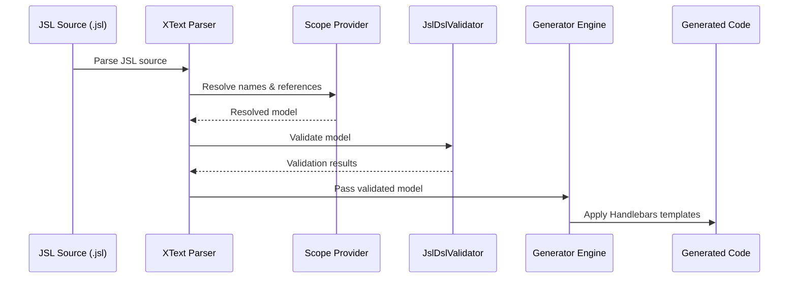

# judo-meta-jsl

[](https://github.com/BlackBeltTechnology/judo-meta-jsl/actions/workflows/build.yml)

## Introduction

**JSL (JUDO Specification Language)** is a domain-specific language built on top of the [XText](https://www.eclipse.org/Xtext/) language framework. It provides a high-level, declarative way to define data models, business logic, and UI specifications for applications built on the [JUDO platform](https://github.com/BlackBeltTechnology/judo-community).

This repository contains:

- **The JSL grammar and language tooling** — parser, validator, scope resolver, formatter, and error message generator
- **Eclipse IDE plugin** — with content assist, syntax highlighting, and PlantUML preview
- **Language Server Protocol (LSP) server** — for editor-agnostic IDE support (VS Code, Monaco, etc.)
- **Code generator engine** — Handlebars-based template engine that transforms JSL models into code
- **OSGi bundle** — for deployment into standard OSGi containers (Karaf)

## Module Overview

The project is a multi-module Maven build that spans both standard Maven and Eclipse/Tycho packaging:



## Build & Development

### Prerequisites

- **Java 21** JDK
- **Maven 3.9.4+** (or use the included `./mvnw` wrapper)

### Build Commands

```bash
# Full build and install
./mvnw clean install

# Run tests only
./mvnw clean test

# Run a single test class
./mvnw -pl model-test test -Dtest=JslDslParserTest
```

### Code Generation (after grammar changes)

The XText language infrastructure (parser, serializer, EMF model classes) is regenerated from the grammar using MWE2 workflows:

- **In Eclipse:** Run the `Generate JSL.launch` launcher
- **CLI alternative:** Run the MWE2 workflow `hu.blackbelt.judo.meta.jsl.model project src/workflow/generateModel.mwe2`

> **Note:** Generated code lives in `src/main/xtext-gen/`, `src/main/xtend-gen/`, and `model/generated/`. Do not edit these directories manually.

### Testing in Eclipse

Run the `Launch JSL.launch` launcher to start an Eclipse runtime with the JSL plugin installed. Make sure the Maven build or code generation has completed successfully first.

## Key Architecture



The language pipeline follows the standard XText architecture:

1. **Grammar** (`JslDsl.xtext`) defines the syntax — entity declarations, transfer objects, actors, views, expressions
2. **Scoping** resolves cross-references between model elements using custom scope providers
3. **Validation** (`JslDslValidator.xtend`, ~99KB) enforces semantic rules and constraints
4. **Formatting** applies consistent code style
5. **Generation** transforms the model through Handlebars templates controlled by YAML descriptors

## Context

This project is a building block of the [judo-community](https://github.com/BlackBeltTechnology/judo-community) aggregator project. See the corresponding documentation for how this module fits into the broader JUDO ecosystem.

## Contributing

Everyone is welcome to contribute to JUDO! Please see [CONTRIBUTING.md](CONTRIBUTING.md) for details on the development workflow, branching strategy, and submission guidelines.

## License

This project is licensed under the [Eclipse Public License - v 2.0](https://www.eclipse.org/legal/epl-2.0/).
