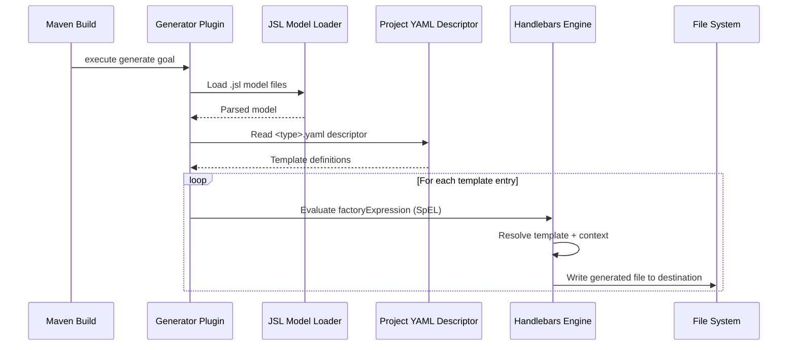
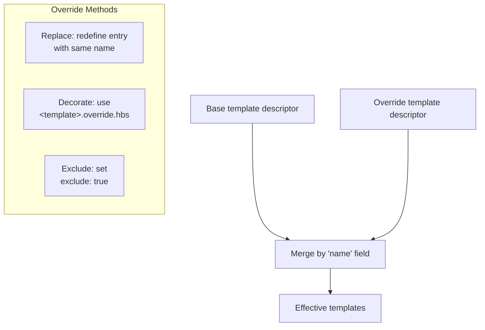

# JUDO JSL Generator Maven Plugin

This Maven plugin executes code generators against JUDO JSL models. It loads JSL model files, applies Handlebars-based templates controlled by YAML descriptors, and writes the generated output (source code, configuration files, project skeletons) to a target directory.

## How It Works

The generation pipeline connects several components:



## Requirements

- Maven 3.9.4+
- Java 21

## Installation

Add the plugin to your `pom.xml`. Replace `LATEST_VERSION` with the current release version:

```xml
<plugin>
    <groupId>hu.blackbelt.judo.meta</groupId>
    <artifactId>judo-jsl-generator-maven-plugin</artifactId>
    <version>LATEST_VERSION</version>
</plugin>
```

## Usage

### Full Configuration Example

```xml
<plugin>
   <groupId>hu.blackbelt.judo.meta</groupId>
   <artifactId>judo-jsl-generator-maven-plugin</artifactId>
   <version>${judo-meta-jsl-version}</version>
   <executions>
      <execution>
            <id>execute-jsl-test-model-from-artifact</id>
            <phase>test</phase>
            <goals>
               <goal>generate</goal>
            </goals>
            <configuration>
               <jslModel>
                  mvn:hu.blackbelt.judo.tatami:judo-tatami-test-jsl:${judo-tatami-version}!model/test-jsldsl.model
               </jslModel>
               <sources>
                  mvn:hu.blackbelt.judo.tatami:judo-tatami-test-jsl:${judo-tatami-version}!model
               </sources>
               <scanSources>false</scanSources>
               <modelNames>ModelName,ModelName2</modelNames>
               <srcModelTarget>${project.basedir}/target/classes/model</srcModelTarget>
               <uris>
                  <uri>mvn:hu.blackbelt.judo.meta:judo-hsk-fullstack-karaf-project-archetype:${version}</uri>
                  <uri>${basedir}/src/main/resources</uri>
               </uris>
               <helpers>
                  <helper>hu.blackbelt.judo.jsl.fullstack.project.archetype.PsmProjectHelper</helper>
               </helpers>
               <type>fullstack-project</type>
               <destination>${basedir}/target/test-classes/js/artifact</destination>
               <templateParameters>
                  <judoPlatformVersion>${judo-platform-version}</judoPlatformVersion>
               </templateParameters>
               <contextAccessor>hu.blackbelt.judo.jsl.fullstack.project.archetype.ActorTypeValueResolver</contextAccessor>
               <scanDependencies>true</scanDependencies>
               <actors></actors>
            </configuration>
      </execution>
   </executions>
   <dependencies>
       <dependency>
           <groupId>hu.blackbelt.judo.meta</groupId>
           <artifactId>hu.blackbelt.judo.meta.jsl.model.northwind</artifactId>
           <version>${judo-meta-jsl-version}</version>
       </dependency>
   </dependencies>
</plugin>
```

### Configuration Parameters

| Parameter | Required | Default | Description |
|-----------|----------|---------|-------------|
| `jslModel` | No | — | JSL standalone model file URI. When defined, `sources` is ignored. |
| `sources` | No | — | JSL model source URIs to search for `.jsl` files. |
| `scanSources` | No | `false` | Scan sources from dependencies. Used when `sources` is set. |
| `modelNames` | No | All models | Comma-separated logical model names to compile. Useful when multiple `.jsl` files exist but only specific models should be compiled. |
| `srcModelTarget` | No | `${project.basedir}/target/classes/model` | Directory for model resources. JSL files in this directory are cleaned before generation to avoid duplicate validation errors. |
| `uris` | Yes | — | Template URIs loaded in reverse order (last URI takes priority). Templates can be layered — later URIs extend and override earlier ones. |
| `helpers` | No | — | Fully-qualified class names for helper classes usable in SpEL and Handlebars templates. Classes implementing `ValueResolver` are auto-registered as Handlebars value resolvers. |
| `type` | Yes | — | Project type identifier. Resolves the descriptor file `<type>.yaml`. |
| `destination` | No | `${project.basedir}/target/classes/model` | Output directory. When multiple actors are defined, each gets a separate subfolder. |
| `templateParameters` | No | — | Key-value pairs accessible in SpEL and Handlebars templates by name. |
| `contextAccessor` | No | — | Class that binds Handlebars, SpEL, and parameter contexts. See Context Accessor section below. |
| `scanDependencies` | No | `false` | Scan classpath for `@TemplateHelper` and `@ContextAccessor` annotated classes. |
| `actors` | No | All actors | Comma-separated fully-qualified actor class names to generate. |

### URI Format

URIs support both file paths and Maven artifact references:

```
mvn:<groupId>:<artifactId>[:<extension>[:<classifier>]]:<version>[!path/in/archive]
```

## Project Type YAML Descriptor

The `<type>.yaml` file controls the generation process. It defines which templates to apply, how to compute file paths, and what context to pass to templates. The file uses SpEL expressions evaluated against the JSL model and registered helpers.

### Template Entry Structure

```yaml
- name: file_for_actor           # (1) Unique template name (used for overrides)
  factoryExpression: "{#actorTypes}"  # (2) SpEL expression returning a list of root objects
  actorTypeBased: false           # (3) If true, template runs once per actor type
  exclude: false                  # (4) Set true in overrides to remove this template
  pathExpression: >               # (5) SpEL expression computing the output file path
    'lib/' +
    #path(#actorType.name) + '/' +
    'file_for_actor.test'
  templateName: lib/file_for_actor.test.hbs  # (6) Handlebars template file
  templateContext:                # (7) Additional template variables
    - name: actorTypeAsVariable
      expression: "#self"
  copy: false                     # (8) If true, copy template as binary (no rendering)
```

### Overriding Templates

Templates can be customized at multiple levels:



There are three ways to override templates:

1. **Replace** — Define an entry with the same `name` in the override descriptor. All fields are replaced.
2. **Decorate** — Create a file named `<original>.override.hbs`. The original template is available via Handlebars fragment syntax.
3. **Exclude** — Set `exclude: true` on an entry with the same `name` to remove it entirely.

Override descriptors are processed in reverse URI order — the last defined override takes priority.

### Ignoring Generated Files

To keep manually edited files from being overwritten, create a `.generator-ignore` file using glob patterns (same syntax as `.gitignore`).

## Context Accessor

A context accessor class binds runtime context (Handlebars, SpEL, parameters) for use in templates. It can implement any combination of:

```java
// Handlebars context — called immediately before templating
public static void bindContext(com.github.jknack.handlebars.Context context)

// SpEL context — called before any templating (usable in YAML and templates)
public static void bindContext(
    org.springframework.expression.spel.support.StandardEvaluationContext context)

// External parameters — called before any templating
public static void bindContext(java.util.Map<String, Object> parameters)
```

When `scanDependencies` is `true`, classes annotated with `@ContextAccessor` are auto-discovered. If multiple classes are found, an error is thrown.

> **Tip:** Store context in `ThreadLocal` variables because templating runs in multiple threads.
