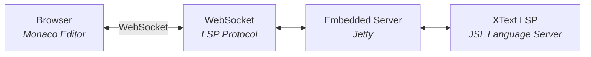

# judo-jsl-web-editor

A self-hosted web application that provides a browser-based JSL editor powered by the Language Server Protocol. It bundles a WebSocket-based LSP server with a Monaco editor frontend, all packaged into a single executable JAR.

## Architecture



The application consists of two parts:

- **Server** — A Java process that serves static web content and runs the JSL language server over WebSocket
- **Client** — A Monaco-based web editor pre-configured with JSL syntax support (see the `client/` directory and its own README for details)

## Build

```bash
mvn clean install
```

## Run

The `target/` directory contains the executable fat JAR:

```bash
java -jar ./target/hu.blackbelt.judo.meta.jsl.server.web-<VERSION>.jar
```

## Parameters

| Flag | Default | Description |
|------|---------|-------------|
| `-host <ip>` | `0.0.0.0` | Network interface to listen on (all interfaces by default) |
| `-port <number>` | `5051` | Port for the LSP server. Update client config if changed. |
| `-trace` | disabled | Enable trace logging for debugging LSP communication |
| `-contextPath <path>` | `/` | URL path for serving static content |
| `-websocketPath <path>` | `/jsl` | URL path for the LSP WebSocket endpoint. Update client config if changed. |
| `-noValidate` | disabled | Disable request validation |
